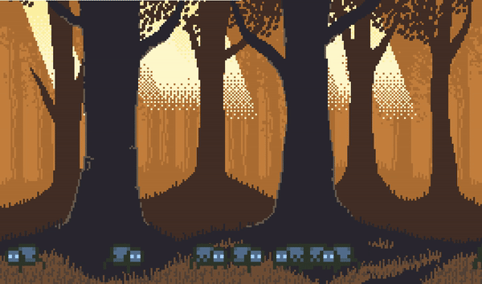

# Overview
Pumpkin Shooter is a simple projectile-based game where you shoot pumpkins from the sky and hit spiders on the ground. Once all the spiders are gone, you win. The physics were done with basic mechanics equations. There is a two-cycle animation for the spiders on the ground. You can add hitboxes if you'd like; it's a setting near the beginning of the code.
# Environment
* Python 3.8
* VSCode
* ` pip install pygame ` 

# Execution
Simply hit Run and it will open up a new window. Use your mouse to change the trajectory, and then click once to throw a pumpkin.

# Useful Websites
* [PyGame Documentation](https://www.pygame.org/docs/)
* [OpenGameArt/ansimuz](https://opengameart.org/users/ansimuz)
* [OpenGameArt/codeinfernogames](https://opengameart.org/users/codeinfernogames)
* [OpenGameArt/pixelthen](https://opengameart.org/users/pixelthen)

